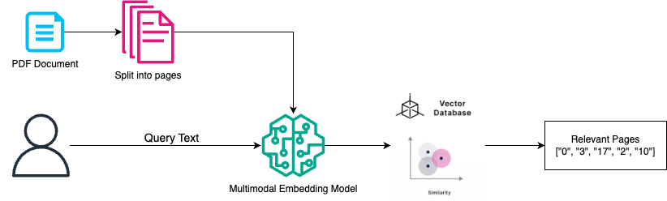

# MDRChallenge_2025_Task1
**MMDocIR: Multi-Modal Retrieval for Long Documents**

## Task 1: MMDocIR – Multi-Modal Retrieval for Long Documents
This task evaluates the ability of retrieval systems to identify visually-rich information within documents. The MMDocIR evaluation set includes **313 long documents** with an average of **65.1 pages**, categorized across diverse domains:

- Research Reports  
- Administration  
- Industry  
- Tutorials  
- Workshops  
- Academic Papers  
- Brochures  
- Financial Reports  
- Guidebooks  
- Government Documents  
- Laws  
- News Articles  

Each domain presents a unique distribution of multi-modal information, posing distinct retrieval challenges.

### Objective
**For a given text query → Retrieve the Relevant Document Page**:  
Identify the most relevant pages within a document in response to a user query. The retrieval scope for each query is restricted to all pages in the given document.

---

## 📁 Project Structure

```
MDRChallenge_2025_Task1/
├── data_task1/
│   ├── MMDocIR_gt_remove.jsonl  # JSONL file with QuestionID, Questions, Doc Name and other info
├── misc/
│   ├── retrieval_workflow.png # Code Workflow
├── src/
│   ├── task1_ColQwen2.py      # End-to-end pipeline: embedding + querying + retrieval
│   ├── runs.sh                # Shell script to run task1_ColQwen2.py on whole MMDocIR evaluation dataset
├── .gitignore
├── LICENSE
├── README.md
├── requirements.txt           # Python Packages with their versions used

```
---

## Environment Setup
Follow these steps to set up your environment:

```bash
conda create -n rag_env python=3.11
conda activate rag_env
pip install torch==2.5.1 --index-url https://download.pytorch.org/whl/cu121
pip install -r requirements.txt

```
## Hardware Used
Multiple A100 or L40S NVIDIA GPUs with around 48 GB GPU RAM

---

## Dataset Download
Download the dataset from Hugging Face using the following link:  
[MMDocIR Evaluation Set on Hugging Face](https://huggingface.co/datasets/MMDocIR/MMDocIR-Challenge)  

The **MMDocIR evaluation set** will be used for evaluation in this challenge.

---

## Run Task 1: Multimodal Document Retrieval Challenge (EReL@MIR)
Execute the challenge using the provided script:

```bash
mkdir model_cache
cd src
./run.sh
```

## Methodology


1. Download the dataset from Hugging Face - https://huggingface.co/datasets/MMDocIR/MMDocIR-Challenge
2. Generate Image and Text embeddings of each page based on the image and the VLM text using ColQwen-based model. Fuse the embeddings.
3. Find query embedding based on the text query i.e. question
4. Find the similarity scores between the page embeddings and the query embedding using late interaction mechanism.
5. Retrieve top-5 pages
